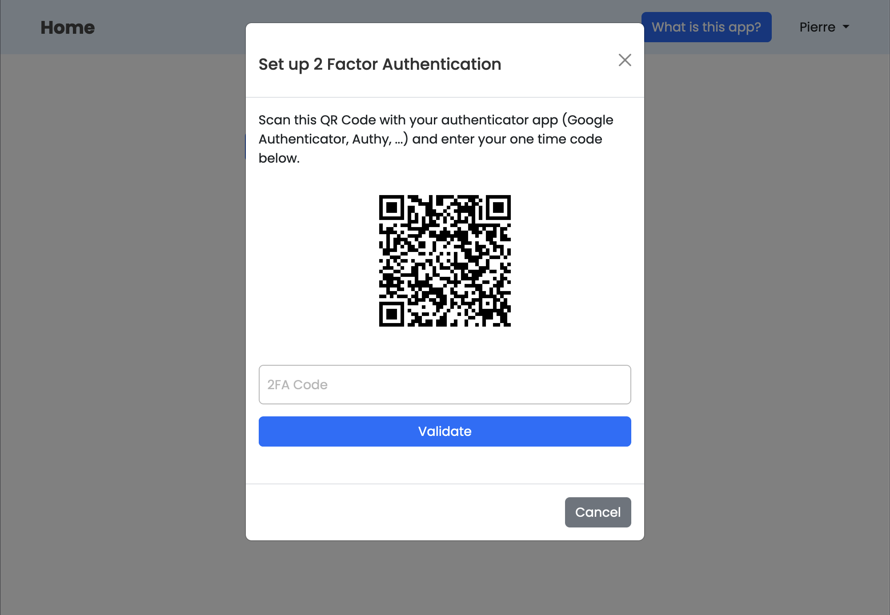
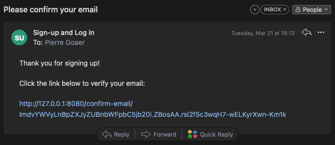
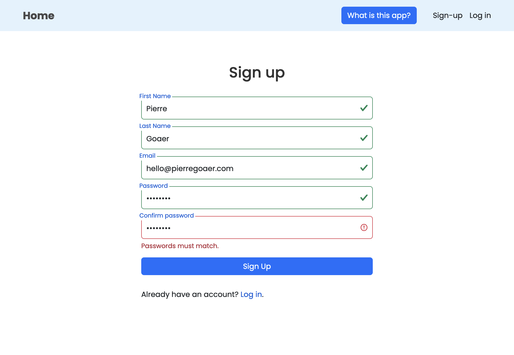
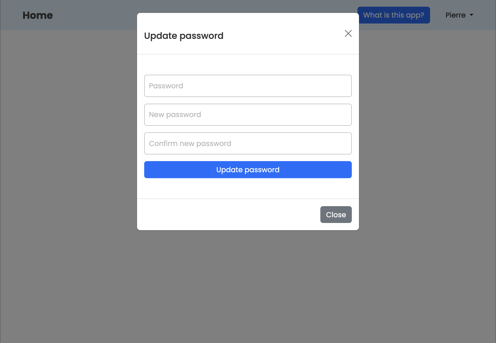
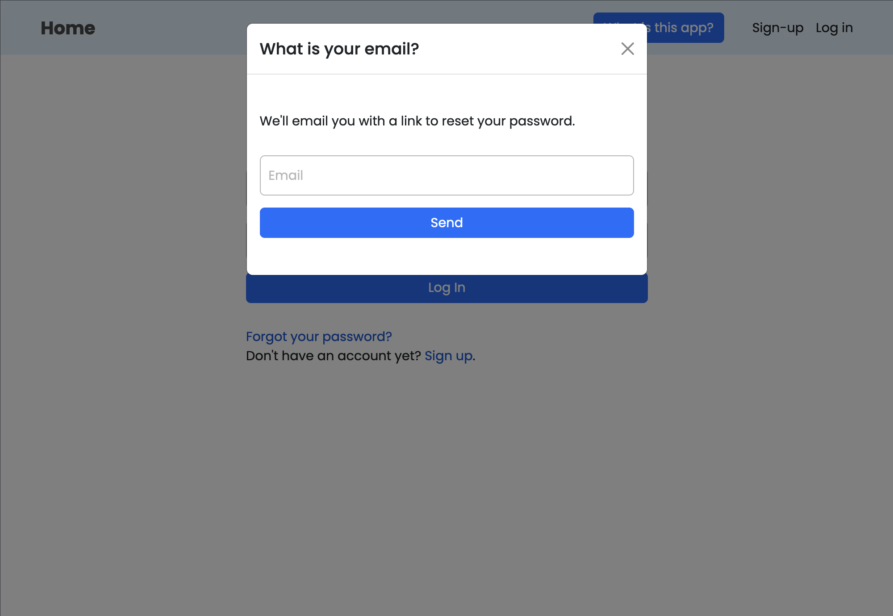
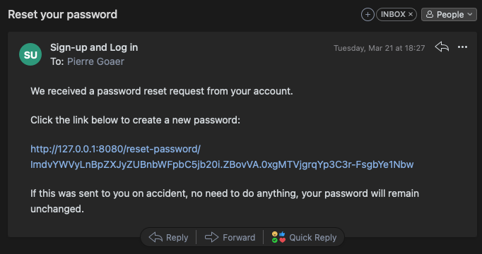

# Advanced sign-up & Log in app

---

This app was built to create all the advanced features of a sign-up or log in process. It is built using Python's
microframework Flask and a MySQL database for the back end, and Bootstrap for the front-end.

Some features implemented:
- 2-Factor Authentication: possibility to add 2FA via a random and dynamically generated QR code. Compatible with all 2FA apps like Google Authenticator, Authy, ...

- Email verification: email with verification with secret token sent to user to confirm their email and activate their accounts.

- Password verification: type password twice when signing up to confirm passwords are matching

- Data: users' credentials are stored in a web hosted MySQL database (the database is wiped clean every day as this is only a demo app)
- Password update: allows users to change their password in the settings

- Password reset: users who forget their passwords can request a reset. They receive a link with a secret token to set a new password.

